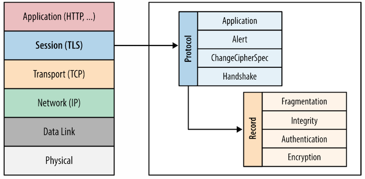

### TLS Proxies and Latency They Bring
1. [Introduction to TLS](#introduction)

2. [TLS interception proxies](#TLS)

    2.1 [Private CA](#Private)

    2.2 [Public subCA](#Public)

3. [Latency proxies bring](#Latency)
    
    3.1 [Weakened cipher](#Weakened)

    3.2 [Vulnerable proxy](#Vulnerable)

    3.3 [Untrusted root](#Untrusted)

4. [Recommendation](#Recommendation)

5. [Reference](#Reference)

#### Introduction to TLS
TLS(Transport Layer Security) is cryptographic protocol to provide integrity, authenticity and confidentiality for end-to-end communication. It is implemented at the application layer and works on top of TCP as seen in Figure 1. TLS uses MAC to ensure integrity, public key to ensure authenticiy and symmetric cryptogrphy to guarantee confidentiality.

Before client and server communicate with each other, They need to initialize the session via handshake. The handshake is involved with exchange of information that's needed for actual application data, such as the format of message and selecting cipher suite. The process of handshake is illustrated in Figure 2.

Firstly, the client sends a ClientHello message to server indicating TLS protocol it supports, a list of cipher suites and compression methods.

Then, the server responds to client with information about TLS protocol, cipher suite and compression method it choses. This message is ServerHello message.

Besides, the server would send his certificate and key related information to client to finish the handshake negotiation.

After that, client needs to tell server his KeyExchange message indicating information like public key or secret for generating symmetric key.

Finally, the two parties are able to use symmetric key to encrypt application data. And handshake is done.

In all, TLS serves the following purposes:

- Negotiate version of TLS protocol
- Agree on cipher suite and compression method
- Exchange information of key material
- Establish safe channel for upper layer

#### TLS interception proxies

TLS provides a convenient way for users to communicate secretly while bringing about supervising problems to legal institutes like government. This leads to birth of many proxies. Proxies act as a middle man between client and server. The relationship is illustrated in Figure 3. This is where interception occurs.
 

Two sessions will be established if client need to connect to server. One is between client and proxy and the other is between proxy and server. For the client side, the proxy is acting as server while for the server side, the proxy is client. The proxy needs to perform handshake both with client and server.

After sessions are initialized, proxy will receive and decrypt messages from client, encrypt and send them to server. This is how the request sent to server. Response from server would backtrack. So we can see that proxy is controlling all messages. There are some differences between communicating using proxies from client communicating directly with server:

- Two sessions exist with different cipher suites and other parameters
- Two certificates are used and one of them is generated by proxy
- The client is not able to validate server's certificate

However, to get client trust, proxy has to show him certificate signed by CA(certificate authority) while server's private key is not available and therefore there is no way to get the server's certificate. There are two ways for proxies to handle this problem. One is generate a private CA for proxy's use and the other is to get sign from subCA.

###### Private CA
A certificate signed with this private CA is distributed to clients and saved as a trusted root. As a result, when proxies use this certificate, client will trust them.

###### Public subCA
Organizations convincing the trusted root to issue subCA certificate to them. Then they are able to use the certificate to sign for proxy purpose.

#### Latency proxies bring
Deployment of proxies may introduce some risk. For deployers of proxies, they may need to deal with some legal issues if they are charged for exposure of private messages. For example, if a company deploys proxy, they need to take employee's right into consideration. For clients, they are likely to encounter message leakage even without knowing it. And the message leakage comes from three kinds of risk, which proxies introduce, including weakened cipher, vulnerable proxy and untrusted root.

###### Weakened cipher
Without proxy, client would communicate directly with server and there only exist one session. As long as the cipher of this session is strong enough, the data they are exchanging is safe. But for two sessions, the three parties - client, server and proxy have to ensure the two cipher suites are both strong. Either of the two suites is broken, data leakage occurs.

###### Vulnerable proxy
Even if proxy makes it possible to supervise communication between client and server, it also gives some chance to behaviors for malicious purpose. Because proxy is able to see plaintext. So it is often the target of attackers. It is possible that proxy uses weak cipher which may be easy to broken. As a result, attackers can eavesdrop and decrypt the messages. Then data leakage occurs.

###### Untrusted root
Since client can only choose to turst proxy if they use it, they will trust anyone that is trusted by proxy. However, there may exist some untrusted root signing certificate themselves. And if proxy choose to trust them, then client would elevate the untrusted root's privilege. This introduces risk of elevating malicious entities' privilege.

#### Recommendation
Proxies are implemented at the risk of authenticiy, integrity and privacy of communication between client and server for the purpose of supervision. Developers and designers need to make effort in order to protect the sessions from the malicious. They can harden proxy, identify and document trust root, use strong cipher suites and test their systems under a variety of attack scenarios.

#### Reference
These figures are all from [SSL/TLS Interception Proxies and Transitive
Trust](https://pdfs.semanticscholar.org/bd1e/35fc81e8d3d1751f1d7443fef2dfdbdc2394.pdf).

And I have referred to [SSL/TLS Interception Proxies and Transitive
Trust](https://pdfs.semanticscholar.org/bd1e/35fc81e8d3d1751f1d7443fef2dfdbdc2394.pdf) and [Transport Layer Security](https://en.wikipedia.org/wiki/Transport_Layer_Security#TLS_handshake) to finish the blog.

